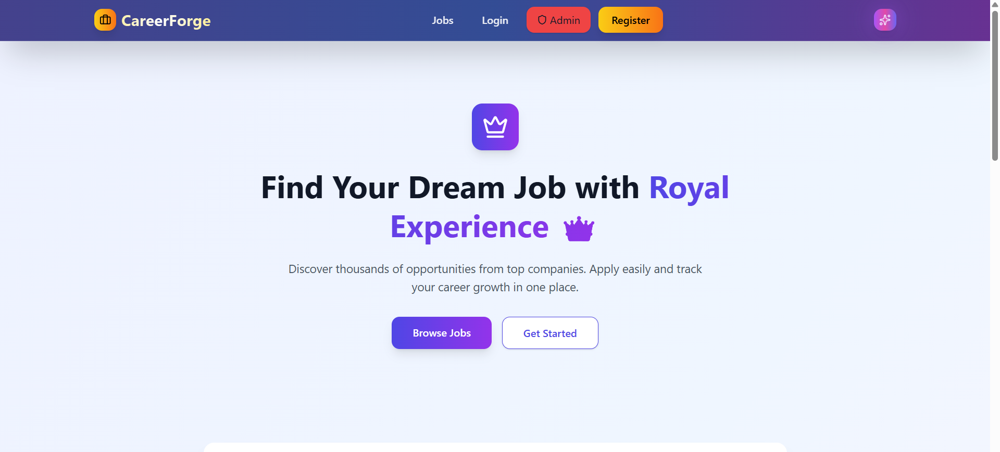
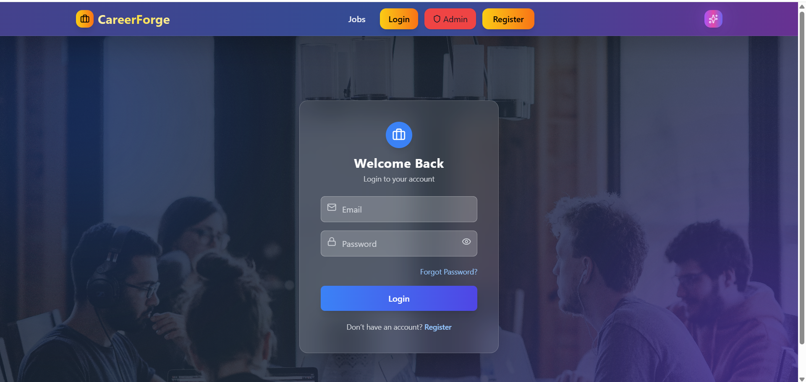
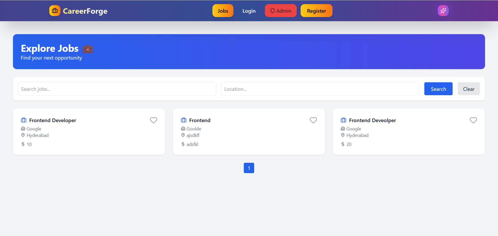
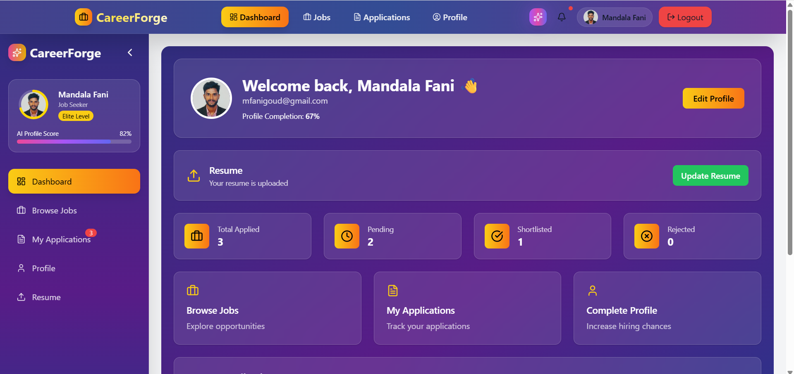
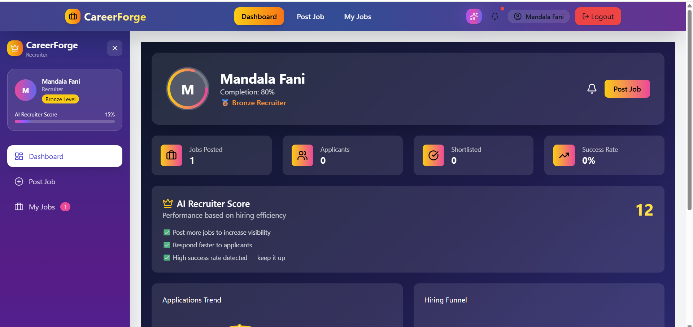
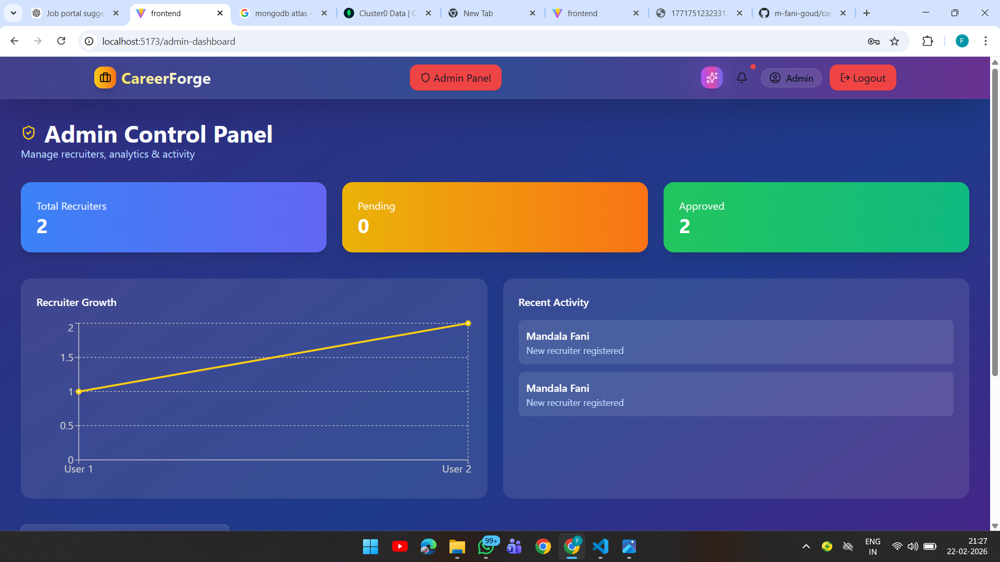
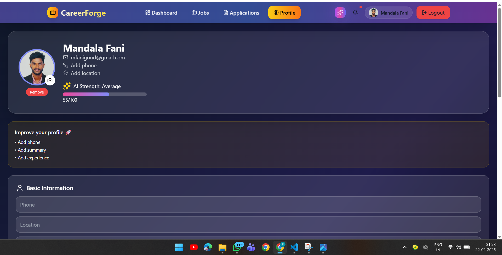
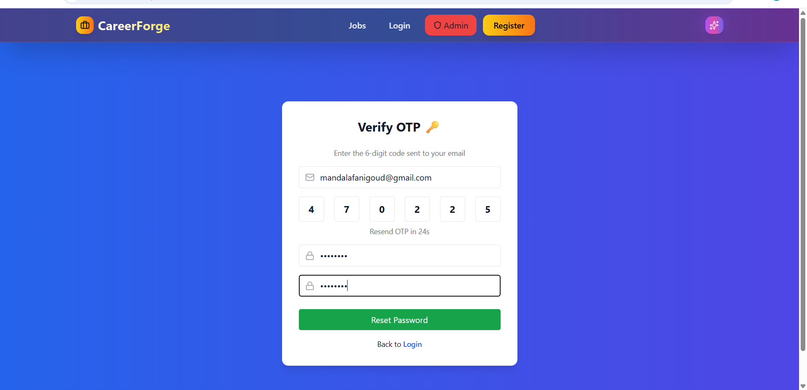

# 🚀 CareerForge — AI Powered Job Portal (MERN Stack)

> A next-generation AI-powered job portal connecting job seekers and recruiters with intelligent analytics, modern UI, and secure architecture.

---

# 🌟 Highlights

✨ Glassmorphism UI  
✨ AI Profile Score  
✨ Recruiter Hiring Insights  
✨ Withdraw Application + Undo  
✨ Role Based Authentication  
✨ Admin Panel  
✨ Mobile Responsive  
✨ Ultra Modern Dashboards  
✨ Production Ready Deployment  

---

# 🧠 Features

## 👤 Job Seeker

- Register / Login / JWT Auth
- Upload Resume
- Apply for Jobs
- Withdraw Application (Undo Option)
- Track Application Status
- AI Profile Strength Score
- Profile Completion Ring
- User Dashboard Analytics

---

## 🏢 Recruiter

- Recruiter Login
- Post Jobs
- Manage Jobs
- View Applicants
- Shortlist / Reject Candidates
- Hiring Analytics Dashboard
- Recruiter Level Badges
- AI Hiring Score

---

## 🛡️ Admin

- Admin Login
- Admin Dashboard
- Platform Monitoring
- Manage Users & Jobs

---

# 🛠️ Tech Stack

## Frontend

- React.js
- Tailwind CSS
- React Router
- Axios
- Lucide Icons
- Charts

## Backend

- Node.js
- Express.js
- MongoDB
- Mongoose
- JWT Authentication
- Multer File Upload

---

# 📂 Folder Structure

```
careerforge-job-portal/
│
├── backend/
│   ├── controllers/
│   ├── routes/
│   ├── middleware/
│   ├── models/
│   ├── uploads/
│   └── server.js
│
├── frontend/
│   ├── src/
│   ├── components/
│   ├── pages/
│   └── App.jsx
│
├── screenshots/
└── README.md
```

---

# ⚙️ Installation Guide

## 1️⃣ Clone Repository

```bash
git clone https://github.com/m-fani-goud/careerforge-job-portal.git
cd careerforge-job-portal
```

---

## 2️⃣ Backend Setup

```bash
cd backend
npm install
```

Create `.env` file inside backend:

```
PORT=5000
MONGO_URI=your_mongodb_connection
JWT_SECRET=your_secret
EMAIL_USER=your_email
EMAIL_PASS=your_password
```

Run backend:

```bash
npm run dev
```

---

## 3️⃣ Frontend Setup

```bash
cd frontend
npm install
npm start
```

---

# 🔐 Environment Variables

Backend `.env`

```
PORT=5000
MONGO_URI=your_mongodb_connection
JWT_SECRET=your_secret
EMAIL_USER=your_email
EMAIL_PASS=your_password
```

---

# 🚀 Deployment Guide (Production)

You can deploy this project using:

✅ Render (Backend)  
✅ Vercel / Netlify (Frontend)  
✅ MongoDB Atlas (Database)  

---

# 🌍 Backend Deployment — Render

### Step 1 — Push Code to GitHub

```bash
git init
git add .
git commit -m "initial commit"
git branch -M main
git remote add origin https://github.com/yourusername/repo.git
git push -u origin main
```

---

### Step 2 — Create Render Account

Go to:

https://render.com

Login with GitHub.

---

### Step 3 — Deploy Backend

1. Click **New Web Service**
2. Select your repository
3. Configure:

```
Root Directory: backend
Build Command: npm install
Start Command: npm start
```

---

### Step 4 — Add Environment Variables in Render

```
PORT=5000
MONGO_URI=your_mongodb_uri
JWT_SECRET=your_secret
EMAIL_USER=your_email
EMAIL_PASS=your_password
```

---

### Step 5 — Deploy

Render will give you:

```
https://your-backend-url.onrender.com
```

---

# 🌐 Frontend Deployment — Vercel

### Step 1 — Go to Vercel

https://vercel.com

Login with GitHub.

---

### Step 2 — Import Project

Select repository → Choose frontend folder.

---

### Step 3 — Add Environment Variable

```
REACT_APP_API_URL=https://your-backend-url.onrender.com/api
```

---

### Step 4 — Deploy

You will get:

```
https://careerforge.vercel.app
```

---

# ⚡ Important Production Changes

## Update API Base URL

Frontend `services/api.js`

```js
const API = axios.create({
  baseURL: process.env.REACT_APP_API_URL,
});
```

---

# 📸 Screenshots

## Home



## Login



## Register


## Jobs



## User Dashboard



## Recruiter Dashboard



## Admin Dashboard



## Profile



## OTP Verify



---

# 🔄 API Endpoints

## Auth

```
POST /api/auth/register
POST /api/auth/login
POST /api/auth/forgot-password
POST /api/auth/reset-password
```

## Jobs

```
GET /api/jobs
POST /api/jobs
GET /api/jobs/my
```

## Applications

```
POST /api/applications
GET /api/applications/me
GET /api/applications/job/:jobId
PUT /api/applications/:id
DELETE /api/applications/:id
PUT /api/applications/restore/:id
```

---

# 🧠 AI Features

- Profile Strength Calculation
- Recruiter Hiring Success Score
- Completion Percentage Ring
- Smart Dashboard Insights

---

# 📱 Mobile Responsive

- Sidebar collapsible
- Navbar adaptive
- Dashboard responsive
- Cards optimized for mobile

---

# 👨‍💻 Author

**Fani Goud**

GitHub:  
https://github.com/m-fani-goud

---

# ⭐ Future Improvements

- Real AI Resume Analysis
- Chat System
- Interview Scheduling
- Notifications System
- Payment Integration
- Deployment on AWS

---

# 📜 License

MIT License

---

# ❤️ Support

If you like this project, give it a ⭐ on GitHub!
